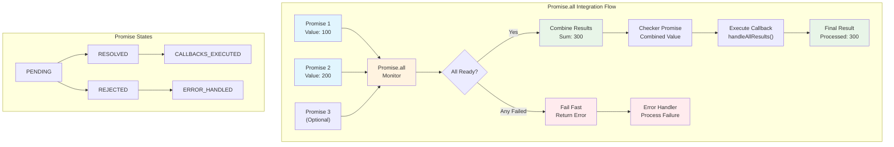

# Cross-Chain Promise Library 🌉

**⚠️ EXPERIMENTAL PROJECT ⚠️**

This is a test project for experimentation, focused specifically on building a **cross-chain promise library** that enables JavaScript-like promise chaining across multiple blockchains. Think `async/await` but for cross-chain smart contract development.

## 🎯 Vision

Imagine writing cross-chain smart contracts like this:

```solidity
// Chain A: Create a promise and chain across multiple networks
bytes32 promise = promiseLib.create();
bytes32 remoteResult = promiseLib.then(promise, chainB, processOnChainB);
bytes32 finalResult = promiseLib.then(remoteResult, chainC, finalizeOnChainC);

// Resolve on Chain A, automatically executes across Chain B → Chain C → back to Chain A
promiseLib.resolve(promise, abi.encode(initialData));
```

No complex message passing, no manual cross-chain coordination - just **promise chaining that works across chains as naturally as it works locally**.

## ✨ Features

### 🏗️ Core Promise System
- **🔗 Promise Chaining**: Link promises together for sequential execution
- **⚡ Manual Execution**: Gas-safe execution with explicit callback triggering
- **🔒 Authorization**: Creator-only resolution/rejection with access controls
- **🚨 Error Handling**: Comprehensive error callbacks and failure recovery
- **🔄 Late Registration**: Register callbacks after promise resolution

### 🌐 Cross-Chain Capabilities
- **🌉 Cross-Chain Chaining**: Chain promises across different blockchains
- **📡 Message Routing**: Automatic cross-chain message handling
- **🏠 Local Proxy Pattern**: Immediate chaining without waiting for cross-chain messages
- **🔐 Secure Authorization**: Cross-domain message sender validation
- **🎯 Deterministic IDs**: Consistent promise IDs across all chains

### 🛡️ Security & Safety
- **👮 Access Control**: Multi-layer authorization for all critical operations
- **🔐 Hash Security**: Collision-resistant hash generation for all operations
- **🚫 Double Protection**: Prevention of double resolution/rejection
- **⚠️ Edge Case Handling**: Comprehensive protection against invalid operations
- **🔧 Callback Recovery**: Graceful handling of callback failures

### 🎛️ Advanced Features
- **📦 Promise.all**: Combine multiple promises with fail-fast behavior
- **🔀 Mixed Data Types**: Support for different data types in promise results
- **⛓️ Promise Chains**: Execute complex multi-step workflows
- **📊 State Management**: Complete promise lifecycle tracking
- **🏃 Execution Control**: Fine-grained control over promise execution

## 🏗️ Core Architecture

1. **`LocalPromise`** - Manual execution promise library with gas safety
2. **`CrossChainPromise`** - Extends LocalPromise with cross-chain capabilities  
3. **`PromiseAwareMessenger`** - Cross-chain message routing with promise context
4. **`PromiseExecutor`** - Safe execution environment for promise chains
5. **`PromiseAll`** - Utility for combining multiple promises
6. **Local Proxy Pattern** - Immediate chaining without waiting for cross-chain messages

### Key Innovation: Local Proxy Promises

The breakthrough insight is creating **local representations** of remote promises:

```solidity
// This returns immediately - no waiting for cross-chain messages!
bytes32 remotePromiseId = promiseA.then(localPromise, chainB, callback);

// You can chain on it right away, even though the remote promise doesn't exist yet
bytes32 nextPromise = promiseA.then(remotePromiseId, chainC, nextCallback);
```

Behind the scenes:
- **Deterministic IDs** ensure the same promise ID exists on all chains
- **State synchronization** keeps local proxies in sync with remote execution
- **Unified API** makes cross-chain feel like local development

## 🧪 Featured Example: Promise.all with Callback Integration

Our Promise.all feature demonstrates combining multiple promises with callback integration:

```solidity
function test_promise_all_with_callback_integration() public {
    console.log("=== Testing Promise.all with Callback Integration ===");
    
    // Create multiple promises for parallel operations
    bytes32 promise1 = promises.create();
    bytes32 promise2 = promises.create();
    
    bytes32[] memory promiseIds = new bytes32[](2);
    promiseIds[0] = promise1;
    promiseIds[1] = promise2;
    
    // Create Promise.all to monitor completion
    bytes32 allPromiseId = promiseAll.createAll(promiseIds);
    
    // Setup result processor that waits for all promises
    bytes32 checkerPromise = promises.create();
    promises.then(checkerPromise, this.handleAllResults.selector);
    
    // Resolve individual promises in parallel
    promises.resolve(promise1, abi.encode(uint256(100)));
    promises.resolve(promise2, abi.encode(uint256(200)));
    
    // Check if all promises completed and process results
    (bool ready, bool failed, bytes[] memory results) = promiseAll.checkAll(allPromiseId);
    
    if (ready && !failed) {
        // Calculate combined result from all promises
        uint256 sum = abi.decode(results[0], (uint256)) + abi.decode(results[1], (uint256));
        promises.resolve(checkerPromise, abi.encode(sum));
        executor.executePromiseCallbacks(checkerPromise);
    }
    
    // Verify callback executed with combined result
    assertTrue(allCallbackExecuted, "Callback should have been executed");
    assertEq(receivedValues[0], 300, "Should have received sum of both values");
    
    console.log("SUCCESS: Promise.all integrates with callback system");
}

function handleAllResults(uint256 combinedValue) external {
    allCallbackExecuted = true;
    receivedValues.push(combinedValue);
    console.log("Combined result received:", combinedValue);
}
```

### Promise.all Flow Diagram



**Key Features Demonstrated:**
- **🔄 Parallel Promise Creation**: Multiple promises can be created and resolved independently
- **📦 Promise.all Monitoring**: Single interface to track completion of multiple promises
- **⚡ Fail-Fast Behavior**: If any promise fails, Promise.all immediately fails
- **🔗 Callback Integration**: Results can be automatically processed through the callback system
- **🎯 Data Aggregation**: Multiple promise results can be combined into a single output

## 🧪 Working End-to-End Test

Our `test_cross_chain_promise_end_to_end()` demonstrates the full round-trip flow:

### Setup: Deterministic Deployment
```solidity
// Deploy identical contracts on both chains using salt
messengerA = new PromiseAwareMessenger{salt: bytes32(0)}();
promisesA = new CrossChainPromise{salt: bytes32(0)}(address(messengerA));

messengerB = new PromiseAwareMessenger{salt: bytes32(0)}();  
promisesB = new CrossChainPromise{salt: bytes32(0)}(address(messengerB));

// Verify same addresses across chains (critical for auth)
require(address(promisesA) == address(promisesB));
```

### Step 1: Promise Creation & Cross-Chain Setup
```solidity
// Create promise on Chain A
bytes32 promiseId = promisesA.create();

// Register cross-chain callback → creates local proxy immediately!
uint256 destinationChain = chainIdByForkId[forkIds[1]];
bytes32 remotePromiseId = promisesA.then(promiseId, destinationChain, this.remoteHandler.selector);

// Verify local proxy exists and is pending
(PromiseStatus status, bytes memory value,) = promisesA.promises(remotePromiseId);
assertEq(uint256(status), 0); // PENDING
```

### Step 2: Resolution & Cross-Chain Forwarding
```solidity
// Resolve original promise
uint256 testValue = 100;
promisesA.resolve(promiseId, abi.encode(testValue));

// Execute callbacks - sends 2 cross-chain messages:
// 1. setupRemotePromise(remotePromiseId, target, selector, ...)  
// 2. executeRemoteCallback(remotePromiseId, value)
promisesA.executeAllCallbacks(promiseId);
```

### Step 3: Remote Execution on Chain B
```solidity
// Messages arrive on Chain B via relayAllMessages()
relayAllMessages();

// Verify remote promise was created and resolved
vm.selectFork(forkIds[1]); // Switch to Chain B
(PromiseStatus remoteStatus, bytes memory remoteValue,) = promisesB.promises(remotePromiseId);
assertEq(uint256(remoteStatus), 1); // RESOLVED
assertEq(abi.decode(remoteValue, (uint256)), 100);

// Verify callback executed successfully  
assertTrue(remoteCallbackExecuted);
assertEq(remoteReceivedValue, 100);
```

### Step 4: Return Path & Local Proxy Sync
```solidity
// Remote callback transforms value and sends back
function remoteHandler(uint256 value) external returns (uint256) {
    remoteCallbackExecuted = true;
    remoteReceivedValue = value;
    return value * 2; // Transform: 100 → 200
}

// Return message automatically sent, relay it back
relayAllMessages();

// Verify local proxy updated with return value
vm.selectFork(forkIds[0]); // Back to Chain A
(PromiseStatus finalStatus, bytes memory finalValue,) = promisesA.promises(remotePromiseId);
assertEq(uint256(finalStatus), 1); // RESOLVED
assertEq(abi.decode(finalValue, (uint256)), 200); // Transformed value!
```

### Complete Flow Verification ✅
```
Chain A (100) → Chain B (remoteHandler) → Chain A (200)
SUCCESS: Complete cross-chain promise end-to-end flow verified!
```

## 📊 Test Results

**48/48 tests passing** across the comprehensive promise ecosystem:
- **LocalPromise**: 17/17 tests ✅ (manual execution, gas safety, chaining)
- **CrossChainPromise**: 7/7 tests ✅ (including full cross-chain e2e flow)
- **SecurityTests**: 12/12 tests ✅ (authorization, edge cases, failure recovery)
- **PromiseAllTests**: 6/6 tests ✅ (parallel promises, fail-fast, data aggregation)
- **PromiseAwareMessenger**: 3/3 tests ✅ (cross-chain messaging)  
- **Promise**: 3/3 tests ✅ (baseline functionality)

### Security Test Coverage
- **🔐 Cross-Chain Authorization**: 4 tests protecting unauthorized access to remote operations
- **👮 Local Authorization**: 2 tests ensuring creator-only resolution/rejection
- **⚠️ Edge Case Protection**: 5 tests covering double resolution/rejection protection
- **🛠️ Failure Recovery**: 1 test for graceful callback failure handling

### Promise.all Test Coverage  
- **✅ Success Cases**: Multi-promise coordination and data aggregation
- **💥 Failure Cases**: Early failure detection with fail-fast behavior
- **🔀 Data Types**: Mixed data type support and proper encoding/decoding
- **🎯 Edge Cases**: Empty arrays, single promises, and integration testing

## ⚠️ Missing Parts (This Might Not Work)

### 1. Deployment & Hardening
- **No production deployment** - only tested in Forge simulation
- **Deterministic deployment** requirements may not work on all chains
- **Gas limit analysis** - cross-chain messages could exceed block gas limits
- **Economic security** - no fee mechanisms or spam protection

### 2. Authentication Vulnerabilities  
- **Wildly vulnerable to auth bugs** - the cross-domain message sender validation is basic
- **Same-address requirement** - relies on deterministic deployment for security
- **Message replay attacks** - no nonce or unique message verification
- **Cross-chain message forgery** - minimal validation of message authenticity

### 3. Test Coverage Gaps
- **Error handling edge cases** - callback failures, gas exhaustion, invalid selectors
- **Multi-chain scenarios** - promises spanning 3+ chains
- **Concurrent execution** - multiple promises resolving simultaneously  
- **State corruption** - malicious actors manipulating promise state
- **Gas optimization** - actual gas costs vs theoretical limits

## 🚀 Future Improvements

### 1. Storage & Gas Efficiency
Once the API stabilizes, optimize storage layout by **emitting events instead of using storage variables**:

```solidity
// Instead of: promises[id] = PromiseState(...)
// Emit: PromiseResolved(id, value, timestamp)
// Read: scan events to reconstruct state
```

**Benefits:**
- **No SSTORE costs** - events are much cheaper than storage
- **Easy state expiry** - log events can be pruned, don't keep promise state forever
- **Better indexing** - external systems can easily track promise lifecycle

### 2. Syntactic Sugar

#### Option A: Proxy Contracts
```solidity
// Create promise-specific proxy contracts
PromiseProxy memory promise = promiseLib.createProxy();
promise.then(chainB, callback).then(chainC, finalizer);
```

#### Option B: Solidity Language Extension (The Dream 🌟)
```solidity
async function crossChainWorkflow() {
    uint256 result = await processOnChainB(initialData);
    uint256 final = await processOnChainC(result);
    return final;
}
```

**This would be so sick** - native `async/await` in Solidity for cross-chain development!

## 🧪 Running Tests

```bash
# Run all tests (48 tests across 6 suites)
forge test

# Run specific test suites
forge test --match-contract SecurityTestsTest       # Security & authorization tests
forge test --match-contract PromiseAllTestsTest     # Promise.all functionality tests  
forge test --match-contract CrossChainPromiseTest   # Cross-chain promise tests

# Run featured Promise.all integration test
forge test --match-test test_promise_all_with_callback_integration -vv

# Run cross-chain end-to-end test with full verbosity
forge test --match-test test_cross_chain_promise_end_to_end -vvv

# Run security tests to verify all protections
forge test --match-contract SecurityTestsTest -vv
```

## 🤝 Contributing

This is an experimental research project. If you're interested in:
- Security analysis (please find the bugs!)
- Gas optimization strategies  
- Alternative architectural approaches
- Production deployment considerations

Feel free to open issues or PRs. The goal is to explore what's possible in cross-chain developer experience.

---

**Remember: This is experimental code. Do not use in production. Assume there are critical bugs we haven't found yet.** 🐛
