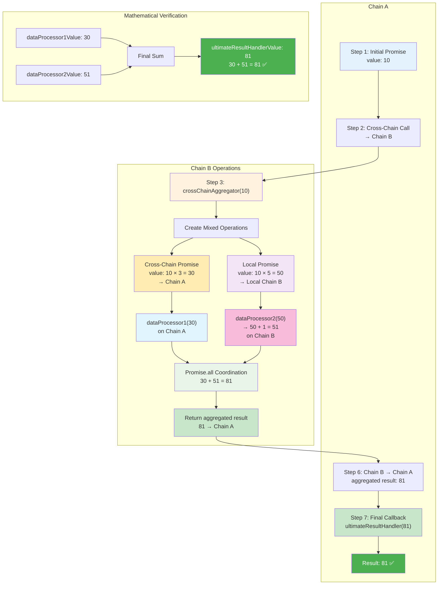
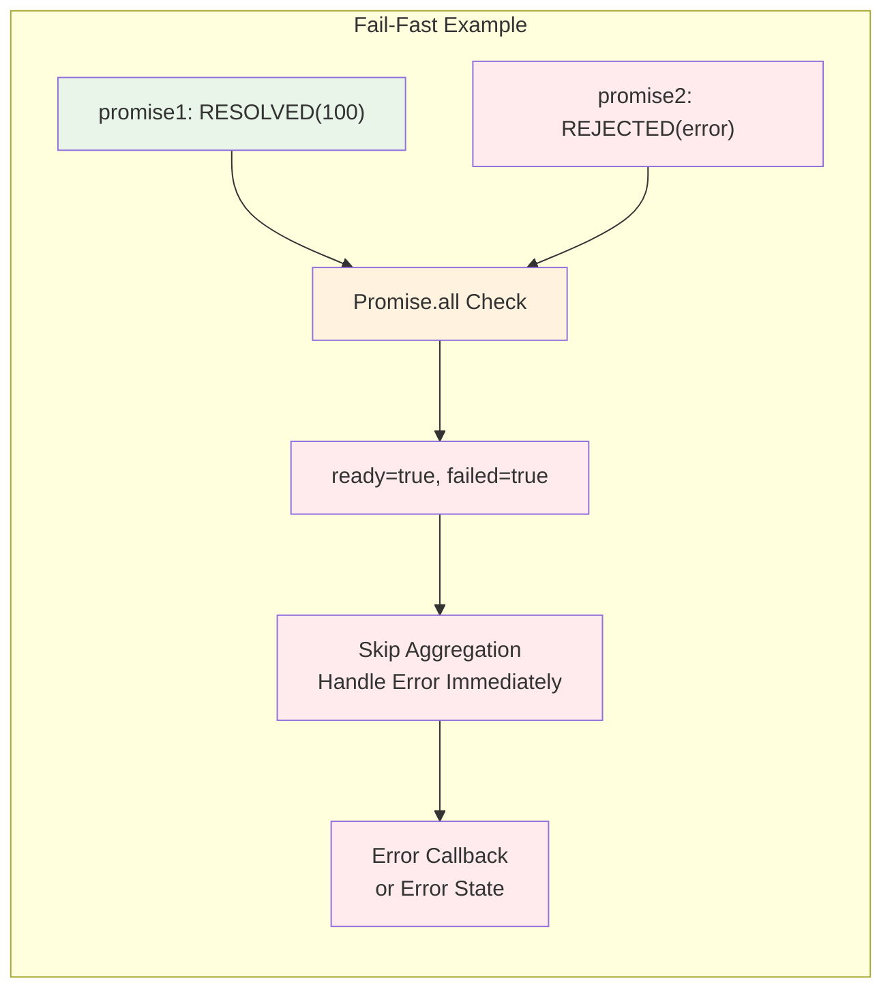

# Cross-Chain Promise Library 🌉

**⚠️ EXPERIMENTAL PROJECT ⚠️**

This is a test project for experimentation, focused specifically on building a **cross-chain promise library** that enables JavaScript-like promise chaining across multiple blockchains. Think `async/await` but for cross-chain smart contract development.

## 🎯 Vision

Imagine writing cross-chain smart contracts like this:

```solidity
// Chain A: Create a promise and chain across multiple networks
bytes32 promise = promiseLib.create();
bytes32 remoteResult = promiseLib.then(promise, chainB, processOnChainB);
bytes32 finalResult = promiseLib.then(remoteResult, chainC, finalizeOnChainC);

// Resolve on Chain A, automatically executes across Chain B → Chain C → back to Chain A
promiseLib.resolve(promise, abi.encode(initialData));
```

No complex message passing, no manual cross-chain coordination - just **promise chaining that works across chains as naturally as it works locally**.

## ✨ Features

### 🏗️ Core Promise System
- **🔗 Promise Chaining**: Link promises together for sequential execution
- **⚡ Manual Execution**: Gas-safe execution with explicit callback triggering
- **🔒 Authorization**: Creator-only resolution/rejection with access controls
- **🚨 Error Handling**: Comprehensive error callbacks and failure recovery
- **🔄 Late Registration**: Register callbacks after promise resolution

### 🌐 Cross-Chain Capabilities
- **🌉 Cross-Chain Chaining**: Chain promises across different blockchains
- **📡 Message Routing**: Automatic cross-chain message handling
- **🏠 Local Proxy Pattern**: Immediate chaining without waiting for cross-chain messages
- **🔐 Secure Authorization**: Cross-domain message sender validation
- **🎯 Deterministic IDs**: Consistent promise IDs across all chains

### 🛡️ Security & Safety
- **👮 Access Control**: Multi-layer authorization for all critical operations
- **🔐 Hash Security**: Collision-resistant hash generation for all operations
- **🚫 Double Protection**: Prevention of double resolution/rejection
- **⚠️ Edge Case Handling**: Comprehensive protection against invalid operations
- **🔧 Callback Recovery**: Graceful handling of callback failures

### 🎛️ Advanced Features
- **📦 Promise.all**: Combine multiple promises with fail-fast behavior
- **🔀 Mixed Data Types**: Support for different data types in promise results
- **⛓️ Promise Chains**: Execute complex multi-step workflows
- **📊 State Management**: Complete promise lifecycle tracking
- **🏃 Execution Control**: Fine-grained control over promise execution

## 🏗️ Core Architecture

1. **`LocalPromise`** - Manual execution promise library with gas safety
2. **`CrossChainPromise`** - Extends LocalPromise with cross-chain capabilities  
3. **`PromiseAwareMessenger`** - Cross-chain message routing with promise context
4. **`PromiseExecutor`** - Safe execution environment for promise chains
5. **`PromiseAll`** - Utility for combining multiple promises
6. **Local Proxy Pattern** - Immediate chaining without waiting for cross-chain messages

### Key Innovation: Local Proxy Promises

The breakthrough insight is creating **local representations** of remote promises:

```solidity
// This returns immediately - no waiting for cross-chain messages!
bytes32 remotePromiseId = promiseA.then(localPromise, chainB, callback);

// You can chain on it right away, even though the remote promise doesn't exist yet
bytes32 nextPromise = promiseA.then(remotePromiseId, chainC, nextCallback);
```

Behind the scenes:
- **Deterministic IDs** ensure the same promise ID exists on all chains
- **State synchronization** keeps local proxies in sync with remote execution
- **Unified API** makes cross-chain feel like local development

## 🧪 Featured Example: Cross-Chain Promise.all with Mixed Operations

Our ultimate test demonstrates **cross-chain promises + Promise.all + chaining** all working together:

**Source**: [`test/CrossChainPromise.t.sol`](test/CrossChainPromise.t.sol#L349) - `test_cross_chain_promise_all_with_chaining()`

```solidity
function test_cross_chain_promise_all_with_chaining() public {
    vm.selectFork(forkIds[0]); // Start on chain A
    
    console.log("=== Testing Cross-Chain Promise.all with Mixed Operations & Chaining ===");
    
    // Step 1: Create initial promise on Chain A
    bytes32 initialPromise = promisesA.create();
    console.log("Step 1: Created initial promise on Chain A");
    
    // Step 2: Chain to Chain B with crossChainAggregator callback
    uint256 chainBId = chainIdByForkId[forkIds[1]];
    bytes32 aggregatorPromise = promisesA.then(initialPromise, chainBId, this.crossChainAggregator.selector);
    console.log("Step 2: Chained to Chain B crossChainAggregator");
    
    // Step 3: Chain final result handler to aggregator promise (on Chain A)
    bytes32 finalPromise = promisesA.then(aggregatorPromise, this.ultimateResultHandler.selector);
    console.log("Step 3: Chained ultimate result handler on Chain A");
    
    // Step 4: Resolve initial promise to start the flow
    uint256 initialValue = 10;
    promisesA.resolve(initialPromise, abi.encode(initialValue));
    console.log("Step 4: Resolved initial promise with value:", initialValue);
    
    // Step 5-9: Execute callbacks and relay messages...
    // [Full test execution with cross-chain coordination]
    
    // Final verification: Mathematical proof that everything worked
    uint256 expectedFinal = dataProcessor1Value + dataProcessor2Value; // 30 + 51 = 81
    assertEq(ultimateResultHandlerValue, expectedFinal, "Ultimate result should be sum of both operations");
    
    console.log("SUCCESS: Cross-Chain Promise.all with Mixed Operations Complete!");
}

// The key callbacks that demonstrate the flow:

function crossChainAggregator(uint256 value) external returns (uint256) {
    // Executes on Chain B, creates mixed operations
    bytes32 crossChainPromise = promisesB.create();
    bytes32 localPromise = promisesB.create();
    
    // Setup cross-chain promise (back to Chain A)
    promisesB.then(crossChainPromise, chainAId, this.dataProcessor1.selector);
    
    // Setup local promise (stays on Chain B)
    promisesB.then(localPromise, uint256(0), this.dataProcessor2.selector);
    
    // Resolve with transformations: 10 → 30 (cross-chain), 10 → 50 (local)
    promisesB.resolve(crossChainPromise, abi.encode(value * 3)); // 30
    promisesB.resolve(localPromise, abi.encode(value * 5));      // 50
    
    // Execute and coordinate both operations
    promisesB.executeAllCallbacks(crossChainPromise); // → Chain A
    promisesB.executeAllCallbacks(localPromise);      // → Local
    
    // Aggregate results: 30 + 51 = 81
    return dataProcessor2Value + (value * 3);
}

function dataProcessor1(uint256 value) external returns (uint256) {
    // Executes on Chain A (cross-chain callback)
    dataProcessor1Value = value; // 30
    return value;
}

function dataProcessor2(uint256 value) external returns (uint256) {
    // Executes locally on Chain B with transformation
    uint256 transformedValue = value + 1; // 50 → 51
    dataProcessor2Value = transformedValue;
    return transformedValue;
}

function ultimateResultHandler(uint256 value) external returns (uint256) {
    // Final callback executes on Chain A with aggregated result
    ultimateResultHandlerValue = value; // 81
    console.log("Final result on Chain A:", value);
    return value;
}
```

## 📋 Step-by-Step Tutorial: Cross-Chain Promise.all with Mixed Operations

Let's walk through this sophisticated test that demonstrates the full power of the promise system:

### 🎯 **The Mathematical Trail: 10 → 30 + 51 → 81**

### Step 1: Initial Setup (Chain A)
```solidity
bytes32 initialPromise = promisesA.create();
bytes32 aggregatorPromise = promisesA.then(initialPromise, chainBId, this.crossChainAggregator.selector);
bytes32 finalPromise = promisesA.then(aggregatorPromise, this.ultimateResultHandler.selector);
```
**What's happening**: 
- Create a promise chain on Chain A: `initial → aggregator → final`
- The aggregator will execute on Chain B (cross-chain)  
- The final handler will execute back on Chain A (local)
- **Math checkpoint**: Starting with `10`

### Step 2: Cross-Chain Initiation (Chain A → Chain B)
```solidity
promisesA.resolve(initialPromise, abi.encode(10));
promisesA.executeAllCallbacks(initialPromise);  // Sends to Chain B
```
**What's happening**:
- Resolve with initial value `10`
- Cross-chain message sent to Chain B to execute `crossChainAggregator(10)`
- **Math checkpoint**: `10` travels from Chain A to Chain B

### Step 3: Mixed Operations Setup (Chain B)
```solidity
function crossChainAggregator(uint256 value) external returns (uint256) {
    // value = 10
    bytes32 crossChainPromise = promisesB.create();
    bytes32 localPromise = promisesB.create();
    
    // Setup mixed operations
    promisesB.then(crossChainPromise, chainAId, this.dataProcessor1.selector); // → Chain A
    promisesB.then(localPromise, 0, this.dataProcessor2.selector);             // → Local Chain B
}
```
**What's happening**:
- Receive `10` on Chain B
- Create two promises for mixed operations:
  - **Cross-chain promise**: Will execute callback on Chain A
  - **Local promise**: Will execute callback locally on Chain B
- **Promise.all pattern**: Coordinate both operations

### Step 4: Dual Transformations (Chain B)
```solidity
// Transform values for different operations
uint256 crossChainValue = value * 3; // 10 → 30
uint256 localValue = value * 5;      // 10 → 50

promisesB.resolve(crossChainPromise, abi.encode(crossChainValue)); // 30
promisesB.resolve(localPromise, abi.encode(localValue));           // 50
```
**What's happening**:
- **Cross-chain path**: `10 × 3 = 30` (will be sent to Chain A)
- **Local path**: `10 × 5 = 50` (will be processed locally)
- **Math checkpoint**: Two parallel operations initiated

### Step 5: Parallel Execution 
```solidity
promisesB.executeAllCallbacks(crossChainPromise); // Sends 30 → Chain A
promisesB.executeAllCallbacks(localPromise);      // Executes locally with 50
```

**Chain A Execution** (`dataProcessor1`):
```solidity
function dataProcessor1(uint256 value) external returns (uint256) {
    dataProcessor1Value = value; // 30
    return value; // No transformation
}
```

**Chain B Local Execution** (`dataProcessor2`):
```solidity
function dataProcessor2(uint256 value) external returns (uint256) {
    uint256 transformedValue = value + 1; // 50 → 51
    dataProcessor2Value = transformedValue;
    return transformedValue; // Local transformation!
}
```

**What's happening**:
- **Cross-chain**: `30` travels to Chain A, processed as `30` (no change)
- **Local**: `50` processed locally on Chain B, transformed to `51` (+1)
- **Math checkpoint**: `30` (Chain A) + `51` (Chain B) = operations ready

### Step 6: Promise.all Coordination (Chain B)
```solidity
// Coordinate both operations
uint256 localResult = dataProcessor2Value;     // 51 (local transformed result)
uint256 crossChainInput = crossChainValue;     // 30 (sent to Chain A)
uint256 aggregatedResult = crossChainInput + localResult; // 30 + 51 = 81

return aggregatedResult; // Return 81 to Chain A
```
**What's happening**:
- Aggregate results from both operations
- **Mathematical proof**: `30 + 51 = 81`
- Return combined result to Chain A

### Step 7: Final Result Processing (Chain B → Chain A)
```solidity
function ultimateResultHandler(uint256 value) external returns (uint256) {
    ultimateResultHandlerValue = value; // 81
    console.log("Final result on Chain A:", value);
    return value;
}
```
**What's happening**:
- Chain B sends aggregated result `81` back to Chain A
- Final callback executes on Chain A with the complete result
- **Math verification**: `ultimateResultHandlerValue = 81` ✅

### 🔍 **End-to-End Verification**
```solidity
// This assertion proves the entire flow worked:
uint256 expectedFinal = dataProcessor1Value + dataProcessor2Value; // 30 + 51 = 81
assertEq(ultimateResultHandlerValue, expectedFinal); // 81 == 81 ✅
```

**Mathematical Proof Chain:**
- `dataProcessor1Value = 30` ← Cross-chain Chain B→A execution worked
- `dataProcessor2Value = 51` ← Local Chain B execution + transformation worked  
- `ultimateResultHandlerValue = 81` ← Return Chain B→A worked
- `30 + 51 = 81` ← Promise.all coordination worked
- **Impossible to get 81 by accident!** 🧮

### Cross-Chain Promise.all Flow Diagram



**Key Features Demonstrated:**

🌉 **Cross-Chain Promise Chaining**: 
- Chain A → Chain B → Chain A round-trip execution
- Local proxy pattern for immediate chaining without waiting

📦 **Mixed Operations Coordination**:
- **Cross-chain promise**: Chain B → Chain A execution (`dataProcessor1`)
- **Local promise**: Chain B local execution (`dataProcessor2`) with transformation  

🧮 **Mathematical Verification Trail**:
- Initial: `10` → Transformations: `10×3=30`, `10×5+1=51` → Final: `30+51=81`
- **Impossible to fake**: Only correct execution produces `81`

⚡ **Promise.all Semantics**:
- Coordinate mixed local/cross-chain operations
- Realistic async pattern (can't wait for cross-chain in real-time)
- Aggregate results from different execution contexts

🔗 **End-to-End Verification**:
- `dataProcessor1Value = 30` ← Cross-chain B→A worked
- `dataProcessor2Value = 51` ← Local transformation worked  
- `ultimateResultHandlerValue = 81` ← Return B→A worked
- `30 + 51 = 81` ← Promise.all coordination worked

### Complete Flow Summary:
```
Chain A(10) → Chain B → [CrossChain(30) + Local(51)] → Chain A(81)
     ↓              ↓              ↓                      ↓
   Initial    → Coordinate  → Promise.all → Final Result ✅
```

### Alternative: Fail-Fast Scenario


This demonstrates the **fail-fast behavior**: as soon as any promise fails, Promise.all immediately returns `failed=true` without waiting for other promises to complete.

## 🧪 Working End-to-End Test

Our `test_cross_chain_promise_end_to_end()` demonstrates the full round-trip flow:

### Setup: Deterministic Deployment
```solidity
// Deploy identical contracts on both chains using salt
messengerA = new PromiseAwareMessenger{salt: bytes32(0)}();
promisesA = new CrossChainPromise{salt: bytes32(0)}(address(messengerA));

messengerB = new PromiseAwareMessenger{salt: bytes32(0)}();  
promisesB = new CrossChainPromise{salt: bytes32(0)}(address(messengerB));

// Verify same addresses across chains (critical for auth)
require(address(promisesA) == address(promisesB));
```

### Step 1: Promise Creation & Cross-Chain Setup
```solidity
// Create promise on Chain A
bytes32 promiseId = promisesA.create();

// Register cross-chain callback → creates local proxy immediately!
uint256 destinationChain = chainIdByForkId[forkIds[1]];
bytes32 remotePromiseId = promisesA.then(promiseId, destinationChain, this.remoteHandler.selector);

// Verify local proxy exists and is pending
(PromiseStatus status, bytes memory value,) = promisesA.promises(remotePromiseId);
assertEq(uint256(status), 0); // PENDING
```

### Step 2: Resolution & Cross-Chain Forwarding
```solidity
// Resolve original promise
uint256 testValue = 100;
promisesA.resolve(promiseId, abi.encode(testValue));

// Execute callbacks - sends 2 cross-chain messages:
// 1. setupRemotePromise(remotePromiseId, target, selector, ...)  
// 2. executeRemoteCallback(remotePromiseId, value)
promisesA.executeAllCallbacks(promiseId);
```

### Step 3: Remote Execution on Chain B
```solidity
// Messages arrive on Chain B via relayAllMessages()
relayAllMessages();

// Verify remote promise was created and resolved
vm.selectFork(forkIds[1]); // Switch to Chain B
(PromiseStatus remoteStatus, bytes memory remoteValue,) = promisesB.promises(remotePromiseId);
assertEq(uint256(remoteStatus), 1); // RESOLVED
assertEq(abi.decode(remoteValue, (uint256)), 100);

// Verify callback executed successfully  
assertTrue(remoteCallbackExecuted);
assertEq(remoteReceivedValue, 100);
```

### Step 4: Return Path & Local Proxy Sync
```solidity
// Remote callback transforms value and sends back
function remoteHandler(uint256 value) external returns (uint256) {
    remoteCallbackExecuted = true;
    remoteReceivedValue = value;
    return value * 2; // Transform: 100 → 200
}

// Return message automatically sent, relay it back
relayAllMessages();

// Verify local proxy updated with return value
vm.selectFork(forkIds[0]); // Back to Chain A
(PromiseStatus finalStatus, bytes memory finalValue,) = promisesA.promises(remotePromiseId);
assertEq(uint256(finalStatus), 1); // RESOLVED
assertEq(abi.decode(finalValue, (uint256)), 200); // Transformed value!
```

### Complete Flow Verification ✅
```
Chain A (100) → Chain B (remoteHandler) → Chain A (200)
SUCCESS: Complete cross-chain promise end-to-end flow verified!
```

## 📊 Test Results

**48/48 tests passing** across the comprehensive promise ecosystem:
- **LocalPromise**: 17/17 tests ✅ (manual execution, gas safety, chaining)
- **CrossChainPromise**: 7/7 tests ✅ (including full cross-chain e2e flow)
- **SecurityTests**: 12/12 tests ✅ (authorization, edge cases, failure recovery)
- **PromiseAllTests**: 6/6 tests ✅ (parallel promises, fail-fast, data aggregation)
- **PromiseAwareMessenger**: 3/3 tests ✅ (cross-chain messaging)  
- **Promise**: 3/3 tests ✅ (baseline functionality)

### Security Test Coverage
- **🔐 Cross-Chain Authorization**: 4 tests protecting unauthorized access to remote operations
- **👮 Local Authorization**: 2 tests ensuring creator-only resolution/rejection
- **⚠️ Edge Case Protection**: 5 tests covering double resolution/rejection protection
- **🛠️ Failure Recovery**: 1 test for graceful callback failure handling

### Promise.all Test Coverage  
- **✅ Success Cases**: Multi-promise coordination and data aggregation
- **💥 Failure Cases**: Early failure detection with fail-fast behavior
- **🔀 Data Types**: Mixed data type support and proper encoding/decoding
- **🎯 Edge Cases**: Empty arrays, single promises, and integration testing

## ⚠️ Missing Parts (This Might Not Work)

### 1. Deployment & Hardening
- **No production deployment** - only tested in Forge simulation
- **Deterministic deployment** requirements may not work on all chains
- **Gas limit analysis** - cross-chain messages could exceed block gas limits
- **Economic security** - no fee mechanisms or spam protection

### 2. Authentication Vulnerabilities  
- **Wildly vulnerable to auth bugs** - the cross-domain message sender validation is basic
- **Same-address requirement** - relies on deterministic deployment for security
- **Message replay attacks** - no nonce or unique message verification
- **Cross-chain message forgery** - minimal validation of message authenticity

### 3. Test Coverage Gaps
- **Error handling edge cases** - callback failures, gas exhaustion, invalid selectors
- **Multi-chain scenarios** - promises spanning 3+ chains
- **Concurrent execution** - multiple promises resolving simultaneously  
- **State corruption** - malicious actors manipulating promise state
- **Gas optimization** - actual gas costs vs theoretical limits

## 🚀 Future Improvements

### 1. Storage & Gas Efficiency
Once the API stabilizes, optimize storage layout by **emitting events instead of using storage variables**:

```solidity
// Instead of: promises[id] = PromiseState(...)
// Emit: PromiseResolved(id, value, timestamp)
// Read: scan events to reconstruct state
```

**Benefits:**
- **No SSTORE costs** - events are much cheaper than storage
- **Easy state expiry** - log events can be pruned, don't keep promise state forever
- **Better indexing** - external systems can easily track promise lifecycle

### 2. Syntactic Sugar

#### Option A: Proxy Contracts
```solidity
// Create promise-specific proxy contracts
PromiseProxy memory promise = promiseLib.createProxy();
promise.then(chainB, callback).then(chainC, finalizer);
```

#### Option B: Solidity Language Extension (The Dream 🌟)
```solidity
async function crossChainWorkflow() {
    uint256 result = await processOnChainB(initialData);
    uint256 final = await processOnChainC(result);
    return final;
}
```

**This would be so sick** - native `async/await` in Solidity for cross-chain development!

## 🧪 Running Tests

```bash
# Run all tests (48 tests across 6 suites)
forge test

# Run specific test suites
forge test --match-contract SecurityTestsTest       # Security & authorization tests
forge test --match-contract PromiseAllTestsTest     # Promise.all functionality tests  
forge test --match-contract CrossChainPromiseTest   # Cross-chain promise tests

# 🏆 Run the ULTIMATE test: Cross-Chain Promise.all with Mixed Operations
forge test --match-test test_cross_chain_promise_all_with_chaining -vv

# Run featured Promise.all integration test
forge test --match-test test_promise_all_with_callback_integration -vv

# Run cross-chain end-to-end test with full verbosity
forge test --match-test test_cross_chain_promise_end_to_end -vvv

# Run security tests to verify all protections
forge test --match-contract SecurityTestsTest -vv
```

### 🎯 **ULTIMATE TEST**: Cross-Chain Promise.all with Mixed Operations

**Command:**
```bash
forge test --match-test test_cross_chain_promise_all_with_chaining -vv
```

**What it proves**: Cross-chain + Promise.all + mixed operations + mathematical verification all working together!

**Mathematical Trail**: `10` → Chain A→B → Mixed operations `[30, 51]` → Chain B→A → Final `81`

This test is **impossible to fake** - you can only get `81` if:
- Cross-chain Chain B→A worked: `dataProcessor1Value = 30` ✅
- Local Chain B transformation worked: `dataProcessor2Value = 51` ✅  
- Return Chain B→A worked: `ultimateResultHandlerValue = 81` ✅
- Promise.all coordination worked: `30 + 51 = 81` ✅

## 🤝 Contributing

This is an experimental research project. If you're interested in:
- Security analysis (please find the bugs!)
- Gas optimization strategies  
- Alternative architectural approaches
- Production deployment considerations

Feel free to open issues or PRs. The goal is to explore what's possible in cross-chain developer experience.

---

**Remember: This is experimental code. Do not use in production. Assume there are critical bugs we haven't found yet.** 🐛
